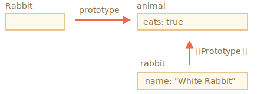

# F.prototype

Modern JavaScript'te protitip'i `__proto__` kullanarak ( bir önceki bölümde anlatıldığı gibi ) ayarlayabiliriz. Fakat bu daha öncesinde böyle değildi.

[cut]

JavaScript başlangıcından beri kalıtıma sahipti. Bu dilin çekirdek özelliklerinden biriydi.

Fakat bunu ayarlamak için sadece bir yol vardı ve bu yol yapıcıda(constructor)'da `"prototype"` kullanmaktı. Hala birçok kodda bu şekilde kullanılmaktadır.

## "Prototip" özelliği

Bildiğiniz gibi, `new F()` yeni bir obje oluşturur.

`new F()` ile yeni bir obje yaratıldığında, obje'nin `[[Prototype]]`'ı `F.prototype` a ayarlanır.

Diğer bir deyişle, eğer `F` `prototype` özelliğine sahip ve bu da obje tipine ayarlanmışsa, `new` operatörü bunu `[[Prototype]]` ayarlamak için kullanır.

Aklınızda bulunsun `F.prototype` burada `F`'in sahip olduğu sıradan bir `"prototype"` objesidir. "prototype" terimine çok benzese de aslında burada gerçekten kullanılan sıradan bir objedir.

Örneğin:

```js run
let animal = {
  eats: true
};

function Rabbit(name) {
  this.name = name;
}

*!*
Rabbit.prototype = animal;
*/!*

let rabbit = new Rabbit("White Rabbit"); //  rabbit.__proto__ == animal

alert( rabbit.eats ); // true
```

`Rabbit.prototype = animal` sözcük anlamıyla: "Eğer yeni bir Rabbit yaratılırsa `new Rabbit`, bunun `[[Prototype]]`ını `animal`'a ata"

Sonuç şu şekildedir:



Görselde  `"prototip"` yataydaki oktur, sıranda bir özelliktir. `[[Prototype]]` ise dikeydir ve `rabbit`'in `animal`'dan miras aldığını ifade eder.

## Sıradan F.prototype, yapıcı( contructor) özelliği

Her fonksiyonun `"prototype"` özelliği bulunmaktadır. Siz belirtmeseniz bile bu geçerlidir.

Varsayılan `"prototype" sadece `contructor` özelliği olan olan ve bu da fonksiyonun kendisini gösteren bir objedir.

Şu şekilde:

```js
function Rabbit() {}

/* varsayılan prototip
Rabbit.prototype = { constructor: Rabbit };
*/
```


Şu şekilde kontrol edebiliriz:

```js run
function Rabbit() {}
// varsayılan:
// Rabbit.prototype = { constructor: Rabbit }

alert( Rabbit.prototype.constructor == Rabbit ); // true
```

Eğer hiç birşey yapmazsak doğal olarak `contructor` özelliği tüm rabbit objelerine `[[Prototype]]` vasıtasıyla iletilir.

```js run
function Rabbit() {}
// varsayılan:
// Rabbit.prototype = { constructor: Rabbit }

let rabbit = new Rabbit(); //  {constructor: Rabbit}'dan miras alır.

alert(rabbit.constructor == Rabbit); // true (prototype'tan gelir)
```


Eğer `constructor` özelliğini kullarak varolan yapıcı ile aynı şekilde bir obje yapabiliriz.

Şu şekilde:

```js run
function Rabbit(name) {
  this.name = name;
  alert(name);
}

let rabbit = new Rabbit("White Rabbit");

*!*
let rabbit2 = new rabbit.constructor("Black Rabbit");
*/!*
```

Bir obje var fakat bu objenin  ( 3. parti kütüphanelerden gelebilir) hangi yapıcısının kullanıldığını bilmiyorsak ve aynısını yaratmak istiyorsak oldukça kullanışlıdır.

Muhtemelen `"contructor"` hakkındaki en önemli şey...

**... JavaScript `"contructor"` değerinin doğru olduğuna garanti vermez.**

Evet, varsayılan `"prototype"` da bulunur fakat hepsi budur, sonrasındaki herşey bize aittir.

Daha özelde, eğer prototip'i tamamen değiştirirsek, bu durumda içinde `"contructor"` olmayacaktır.

Örneğin:

```js run
function Rabbit() {}
Rabbit.prototype = {
  jumps: true
};

let rabbit = new Rabbit();
*!*
alert(rabbit.constructor === Rabbit); // false
*/!*
```

Öyleyse doğru `"contructor"`'ı tutmak için varsayılan prototip'e özellik ekleme/çıkarma yoluna gidebiliriz. Tamamen üzerine yazarsak varsayılan obje kaybolur.

```js
function Rabbit() {}

// Rabbit.prototype üzerine doğrudan yazma!
// sadece ekle
Rabbit.prototype.jumps = true
// varsayılan Rabbit.prototype.contructor bu şekilde korunacaktır.
```

Veya alternatif olarak, `constructor` özelliği tekrar yaratılabilir:

```js
Rabbit.prototype = {
  jumps: true,
*!*
  constructor: Rabbit
*/!*
};

// bu şekilde constructor doğru olur, çünkü bunu el ile belirtmekteyiz.
```


## Özet

Bu bölümde kısaca yapıcı fonksiyonlar ile oluşturulan objelerin `[[Prototip]]`'lerinin nasıl ayarlanabileceğinden bahsettik. İlerde bunların daha gelişmişini programlama kalıpları üzerinde öğreneceksiniz.

Herşey aslında çok basit, birkaç cümle ile daha net anlatmak gerekirse:

<<<<<<< HEAD
- `F.prototype` özelliği `[[Prototype]]` ile aynı değildir. `F.prototype` aslında `new F()` çağırıldığında  `[[Prototype]]`'ı  ayarlar.
- `F.prototype` değeri ya obje ya da null olmalıdır: diğer değerler çalışmaz.
- `"prototype"` özelliği sadece bir yapıcı fonksiyona ayarlandığı ve `new` ile çağırıldığında özel etkisi olur.
=======
- The `F.prototype` property (don't mess with `[[Prototype]]`) sets `[[Prototype]]` of new objects when `new F()` is called.
- The value of `F.prototype` should be either an object or `null`: other values won't work.
-  The `"prototype"` property only has such a special effect when set on a constructor function, and invoked with `new`.
>>>>>>> 3dd8ca09c1a7ed7a7b04eefc69898559902478e1

Normal objeler `prototype`'ın ayrı bir önemi yoktur:
```js
let user = {
  name: "John",
  prototype: "Bla-bla" // hiç bir büyüsü yok
};
```
Varsayılan durumda tüm  fonksiyonlar `F.prototype = { constructor: F}` şeklinde tanımlıdır, bundan dolayı, bir objenin yapıcısına `"constructor"` özelliği ile erişilebilir.