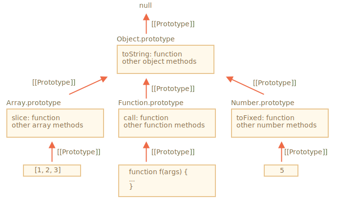
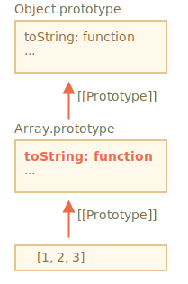

# Doğal prototipler

`"prototype"` özelliği JavaScript çekirdeğinde oldukça fazla kullanılmaktadır. Tüm varsayılan yapıcı fonksiyonlar bunu kullanır.

<<<<<<< HEAD
Önce basit objeler, sonra daha karmaşık olanları için nasıl çalıştığını göreceğiz.
=======
First we'll see at the details, and then how to use it for adding new capabilities to built-in objects.
>>>>>>> 7b76185892aa9798c3f058256aed44a9fb413cc3

## Object.prototype

Diyelim ki boş bir objeyi yazdırdınız:

```js run
let obj = {};
alert( obj ); // "[object Object]" ?
```

`"[object Object]"` yazısını oluşturan kod nerede? Bu varsayılan `toString` metodu, ama asıl soru nerede? bu `obj` boş!

...Fakat `obj = {}` ile `obj = new Object()` aslında aynı anlama gelmektedir. `Object` object yapıcı fonksiyonudur. Bu fonksiyon `Object.prototype`'e ki bu da büyük bir `toString`'e sahip objeye ve diğer fonksiyonlara sahiptir.

Aşağıdaki gibi( Tamamı gömülüdür):


`new Object()` çağrıldığında ( veya `{...}` ile yaratıldığında ) Objenin `[[Prototype]]`'i  bir önceki bölümde bahsettiğimiz gibi `Object.prototype`'a ayarlanır.


Sonrasında `obj.toString()` çaprıldığında -- Bu metod `Object.prototype`'tan alınır.

Bunu şu şekilde kontrol edebiliriz:

```js run
let obj = {};

alert(obj.__proto__ === Object.prototype); // true

alert(obj.toString === obj.__proto__.toString); //true
alert(obj.toString === Object.prototype.toString); //true
```

<<<<<<< HEAD
`Object.prototype`'ın üstünde başka bir `[[Prototype]]` yoktur.
=======
Please note that there is no more `[[Prototype]]` in the chain above `Object.prototype`:
>>>>>>> 7b76185892aa9798c3f058256aed44a9fb413cc3

```js run
alert(Object.prototype.__proto__); // null
```

## Diğer gömülü prototipler

`Array`, `Date`, `Function` gibi diğer gömülü objeler metodlarını prototype üzerinde tutar.

<<<<<<< HEAD
Örneğin, `[1,2,3]` bir array yarattığınızda içte varsayılan `new Array()` yapıcısı kullanılır. Bundan dolayı dizi dizi objesi yeni bir objeye yazılır ve `Array.prototype` bunun prototipi olur ve metodlar sağlar. Bu hafızayı oldukça etkin kullanmaya yarar.

Tanım gereği, tüm gömülü prototipler üstünde `Object.prototype`'a sahip olmalıdır. Bazen "herşey objelerden kalıtım alır" sözünü duyarsınız.
=======
For instance, when we create an array `[1, 2, 3]`, the default `new Array()` constructor is used internally. So `Array.prototype` becomes its prototype and provides methods. That's very memory-efficient.

By specification, all of the built-in prototypes have `Object.prototype` on the top. That's why some people say that "everything inherits from objects".
>>>>>>> 7b76185892aa9798c3f058256aed44a9fb413cc3

Aşağıda bunun etraflı bir görselini görebilirsiniz. 



Prototipleri inceleyecek olursak:

```js run
let arr = [1, 2, 3];

// Array.prototype'tan mı kalıtım alıyor?
alert( arr.__proto__ === Array.prototype ); // true

// peki ya Object.prototype'tan mı?
alert( arr.__proto__.__proto__ === Object.prototype ); // true

// Peki ya onun üzerine bir null.
alert( arr.__proto__.__proto__.__proto__ ); // null
```

Bazı metodlar üst üste gelebilir, örneğin `Array.prototype` kendine ait bir `toString` metoduna sahiptir ve bu da elemanları arasına virgül koyarak çıktı vermesini sağlar:

```js run
let arr = [1, 2, 3]
alert(arr); // 1,2,3 <--  Array.prototype.toString'in sonucu
```

Daha önce de gördüğümüz gibi, `Object.prototype`'ın `toString` metodu bulunmaktadır fakat `Array.prototype` bu zincirlemede daha yakındır ve bundan dolayı diziler bunu kullanır.





Chrome Developer Tools konsolunda da bu kalıtımı ( console.dir  kullanarak görebilirsiniz ) 


Diğer gömülü objeler de aynı şekilde çalışır, hatta fonksiyonlar bile. Bunlar gömülü `Fonksiyon` yapıcısının objeleridir, `call/apply` gibi metodları ve diğerleri `Function.prototype`'tan alınmıştır. Fonksiyonların kendine ait `toString` metdoları da bulunmaktadır.

```js run
function f() {}

alert(f.__proto__ == Function.prototype); // true
alert(f.__proto__.__proto__ == Object.prototype); // true, objelerden kalıtım alır.
```

## İlkel tipler

En karışık yapılar karakter dizileri, sayılar ve boolean ile yapılır.

<<<<<<< HEAD
Hatırlayacağınız üzere bunlar obje değildirler. Fakat özelliklerine erişmeye çalıştığınızda, gömülü yapıcı obje ile geçici objeler üretilir. Bunlar `String`, `Number`, `Boolean` metodlarını sağlar ve yok olurlar.
=======
As we remember, they are not objects. But if we try to access their properties, temporary wrapper objects are created using built-in constructors `String`, `Number` and `Boolean`. They provide the methods and disappear.
>>>>>>> 7b76185892aa9798c3f058256aed44a9fb413cc3

Bu objeler gizli üretilir ve çoğu motor bunları optimize edebilir, Fakat şartname bunu tam olarak bu şekilde tanımlar. Bu objelerin metodları da prototype'ta yer alır, `String.prototype`, `Number.prototype` ve `Boolean.prototype` olarak bulunur.

<<<<<<< HEAD
=======
```warn header="Values `null` and `undefined` have no object wrappers"
Special values `null` and `undefined` stand apart. They have no object wrappers, so methods and properties are not available for them. And there are no corresponding prototypes either.
```
>>>>>>> 7b76185892aa9798c3f058256aed44a9fb413cc3

```warn header="`null` ve `undefined` object kapsayıcılara sahip değildir. Bundan dolayı metodlar ve özellikler bunlar için mevcut değildir. Ayrıca bunlara uyan prototipler de bulunmamaktadır.```

## Doğal prototiplerin değiştirilmesi [#yerli-prototip-değişikliği]

Doğal(native) prototipler modifiye edilebilir. Örneğin, `String.prototype`'a bir metod eklersek, bu tüm karakter dizileri için geçerli olur:

```js run
String.prototype.show = function() {
  alert(this);
};

"BOOM!".show(); // BOOM!
```
Geliştirme sürecinde hangi fikirlerin gömülü olması gerektiğine dair fikrimiz olabilir. Hatta doğal prototiplere ekleme yapmak için istek duyabilirsiniz. Fakat bu genelde kötü bir fikiridir.

<<<<<<< HEAD
Prototipler evrenseldir, bundan dolayı kolayca ikilik çıkarabilir. Eğer iki kütüphane `String.prototype.show` şeklinde metod eklerse bunlardan biri diğerinin üzerine yazar.

Modern programlama da sadece bir koşulda doğal prototiplerin düzenlenmesine izin verilir. Buna pollyfills denir. Diğer bir deyişle eğer JavaScript şartnamesinde bir metod var fakat bu JavaScript motoru tarafından henüz desteklenmiyorsa, bunu elle yazmak ve gömülü prototipe eklemek mümkündür.

Örneğin:
=======
During the process of development, we may have ideas for new built-in methods we'd like to have, and we may be tempted to add them to native prototypes. But that is generally a bad idea.

```warn
Prototypes are global, so it's easy to get a conflict. If two libraries add a method `String.prototype.show`, then one of them will be overwriting the method of the other.

So, generally, modifying a native prototype is considered a bad idea.
```

**In modern programming, there is only one case where modifying native prototypes is approved. That's polyfilling.**

Polyfilling is a term for making a substitute for a method that exists in the JavaScript specification, but is not yet supported by a particular JavaScript engine.

We may then implement it manually and populate the built-in prototype with it.

For instance:
>>>>>>> 7b76185892aa9798c3f058256aed44a9fb413cc3

```js run
if (!String.prototype.repeat) { // Eğer böyle bir metod yoksa
  // prototip'e ekle

  String.prototype.repeat = function(n) {
    // karakteri n defa tekrarlar

    // aslında kod bundan daha karmaşık olmalıdır.
    // eğer n negatif bir sayı gelirse hata dönder
    // Algoritma şartnamede belirlenmiştir.
    return new Array(n + 1).join(this);
  };
}

alert( "La".repeat(3) ); // LaLaLa
```

## Prototiplerden ödünç alma

<<<<<<< HEAD
<info:call-apply-decorators#method-borrowing> bölümünde metod ödünç almadan bahsetmiştik.
=======
## Borrowing from prototypes

In the chapter <info:call-apply-decorators#method-borrowing> we talked about method borrowing.

That's when we take a method from one object and copy it into another.

Some methods of native prototypes are often borrowed.

For instance, if we're making an array-like object, we may want to copy some `Array` methods to it.

E.g.
>>>>>>> 7b76185892aa9798c3f058256aed44a9fb413cc3

```js run
function showArgs() {
*!*
  // Array'den join i ödünç al ve argüman kaynağında çağır.
  alert( [].join.call(arguments, " - ") );
*/!*
}

showArgs("John", "Pete", "Alice"); // John - Pete - Alice
```

<<<<<<< HEAD
`join` `Array.prototype` içerisinde bulunduğundan dolayı, oradan doğrudan çağırabilir ve şu şekilde tekrar yazabiliriz:

```js
function showArgs() {
*!*
  alert( Array.prototype.join.call(arguments, " - ") );
*/!*
}
```
Bu daha etkin çünkü ayrıca bir dizi `[]` objesi yaratmaktan kaçınılmıştır. Fakat biraz uzun sürmüştür.
=======
It works because the internal algorithm of the built-in `join` method only cares about the correct indexes and the `length` property. It doesn't check if the object is indeed an array. Many built-in methods are like that.

Another possibility is to inherit by setting `obj.__proto__` to `Array.prototype`, so all `Array` methods are automatically available in `obj`.

But that's impossible if `obj` already inherits from another object. Remember, we only can inherit from one object at a time.

Borrowing methods is flexible, it allows to mix functionalities from different objects if needed.
>>>>>>> 7b76185892aa9798c3f058256aed44a9fb413cc3

## Özet

<<<<<<< HEAD
- Tüm gömülü objeler aynı yapıyı paylaşır:
    - Metodlar prototiplerde saklanır ( `Array.prototype`, `Object.prototype`, `Date.prototype` vs. )
    - Veriyi objenin kendisi tutar ( dizi elemanları, obje özellikleri, tarih vs. )
- İlkel veriler de saklayıcı objelerin prototiplerinde metodlarını tutarlar:`Number.prototype`, `String.prototype`, `Boolean.prototype`. Sadece `undefined` ve `null` için saklayıcı objeler bulunmamaktadır.
- Gömülü prototipler yeni metodlar ile değiştirilebilir. Fakat bunların değiştirilmesi önerilmez. Tek değiştirilebilir diyeceğimiz olay yeni bir standart'ın eklenmesi olabilir, JavaScript motoru henüz o özelliği uygulamamışsa bu standart'ı siz uygulayabilirsiniz.
=======
- All built-in objects follow the same pattern:
    - The methods are stored in the prototype (`Array.prototype`, `Object.prototype`, `Date.prototype`, etc.)
    - The object itself stores only the data (array items, object properties, the date)
- Primitives also store methods in prototypes of wrapper objects: `Number.prototype`, `String.prototype` and `Boolean.prototype`. Only `undefined` and `null` do not have wrapper objects
- Built-in prototypes can be modified or populated with new methods. But it's not recommended to change them. The only allowable case is probably when we add-in a new standard, but it's not yet supported by the JavaScript engine
>>>>>>> 7b76185892aa9798c3f058256aed44a9fb413cc3
