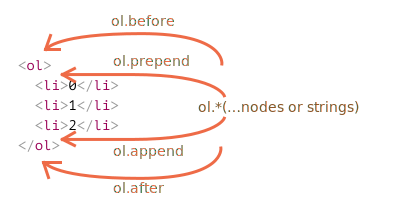
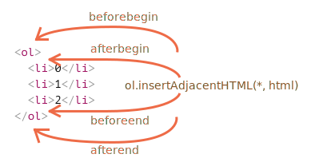

# Modifying the document

DOM değişiklikleri "canlı" sayfalar oluşturmak için anahtardır.

Burada, "anında" nasıl yeni öğeler yaratmayı ve var olan sayfa içeriğini değiştirmeyi göreceğiz.

İlk önce, basit bir örnek göreceğiz ve ondan sonra yöntemleri açıklacağız.

## Example: show a message

Başlangıç için,  sayfa üzerinde `alert`ten daha güzel görünen bir mesajın nasıl eklendiğini görelim.

İşte nasıl görüneceği:

```html autorun height="80"
<style>
.alert {
  padding: 15px;
  border: 1px solid #d6e9c6;
  border-radius: 4px;
  color: #3c763d;
  background-color: #dff0d8;
}
</style>

*!*
<div class="alert">
  <strong>Hi there!</strong>You've read an important message.
</div>
*/!*
```

Bu bir HTML örnegidir. Şimdi ayni `div`i JavaScript ile oluşturalim (farzedelim ki, styles(strong kelimesine referans) hala HTML icinde veya dış CSS dosyası).

## Creating an element


DOM dügümleri(nodes) oluşturmak icin iki yontem vardir:

`document.createElement(tag)`
: Verilen etiketle birlikte yeni bir *element düğümü(element node)* oluşturur:

    ```js
    let div = document.createElement('div');
    ```

`document.createTextNode(text)`
:  Verilen metinle yeni bir *metin düğümü(text node)* oluşturur:

    ```js
    let textNode = document.createTextNode('Here I am');
    ```

### Creating the message

Bizim durumumuzda, verilen sınıflarla ve içindeki mesajla bir “div” yapmak istiyoruz:

```js
let div = document.createElement('div');
div.className = "alert alert-success";
div.innerHTML = "<strong>Merhaba</strong> Onemli bir mesaj okudunuz.";
```

Bundan sonra, DOM elementimiz hazırdır. Şu anda, o sadece bir değişkendir ve onu göremeyiz. Bunun sebebi, o henüz sayfanın içine işlenmemiştir

## Insertion methods

`Div`i göstermek için, onu `document` içinde bir yere eklememiz gerekir. Örneğin, `document.body` içinde.

Bunun için özel bir yöntem `appendChild` vardır: `document.body.appendChild(div)`.

İste tam kode:

```html run height="80"
<style>
.alert {
  padding: 15px;
  border: 1px solid #d6e9c6;
  border-radius: 4px;
  color: #3c763d;
  background-color: #dff0d8;
}
</style>

<script>
  let div = document.createElement('div');
  div.className = "alert alert-success";
  div.innerHTML = "<strong>Hi there</strong>You've read an important message.";

*!*
  document.body.appendChild(div);
*/!*
</script>
```

Burada, bir üst öğeye(parent element) düğüm(node) eklemek için kullanılan yöntemlerin kısa bir listesi (kisaca `parentElem`):

`parentElem.appendChild(node)`
: `parentElem`in son öğesi(last child) olarak 'node'ı ekler.

    Asagidaki ornek, `<ol>`un sonuna yeni bir `<li>` ekler:

    ```html run height=100
    <ol id="list">
      <li>0</li>
      <li>1</li>
      <li>2</li>
    </ol>

    <script>
      let newLi = document.createElement('li');
      newLi.innerHTML = 'Hello, world!';

      list.appendChild(newLi);
    </script>
    ```

`parentElem.insertBefore(node, nextSibling)`
: `nextSibling`den önce `parentElem`e `node` ekler .

    Aşağıdakı kod, ikinci `<li>`den önce yeni bir liste ---- ekler:

    ```html run height=100
    <ol id="list">
      <li>0</li>
      <li>1</li>
      <li>2</li>
    </ol>
    <script>
      let newLi = document.createElement('li');
      newLi.innerHTML = 'Hello, world!';

    *!*
      list.insertBefore(newLi, list.children[1]);
    */!*
    </script>
    ```
    `newLi`yi ilk oge olarak eklemek icin, bunu soyle yapabiliriz:

    ```js
    list.insertBefore(newLi, list.firstChild);
    ```

`parentElem.replaceChild(node, oldChild)`
: `parentElem`in alt ogeleri arasinda `node` ile birlikte `oldChild`i yenisiyle yer degistirir.

Tüm bu yöntemler eklenen düğümü geri döndürür. Diger anlatimla,`parentElem.appendChild(node)` `node`i geri döndürür.Ama genellikle geri döndürülen değer kullanılmaz, sadece yöntemi çalıştırırız.

Bu yöntemler "eskimistir": eski zamanlardan beri varlar ve onlarla birçok eski scriptlerde karsilasabiliriz. Ne yazık ki, bunlar yeterince esnek değillerdir.

Örneğin, bir string olarak varsa *html* nasıl eklenir? Ya da, verilen bir düğüm, üst öğeye(parent) başvurmadan nasıl kaldırılır? Elbette ki, bu yapılabılınır, ama zarif bir şekilde değil.

Bu yüzden, tüm durumları kolayca idare etmek için iki ekleme yöntemi daha vardır.

### prepend/append/before/after

Bu yöntemler kümesi daha esnek eklemeler sunar.

- `node.append(...nodes or strings)` -- düğümün sonuna veya düğümlerin sonundaki stringlere `node`(düğüm) ekler,
- `node.prepend(...nodes or strings)` -- düğüm veya düğüm basindaki stringlere `node`(düğüm) ekler,
- `node.before(...nodes or strings)` –- `node`(düğüm)'den once düğümler veya stringler ekler,
- `node.after(...nodes or strings)` –- `node`(düğüm)'den sonra düğümler veya stringlere ekler,
- `node.replaceWith(...nodes or strings)` –- verilen düğümler veya stringler, `node` ile  yer değistirir.

Bunlarin hepsi DOM düğümler ve/veya stringlerinin bir listesini kabul eder. Eğer bir string verilirse, metin düğümü(text node) olarak eklenir.

İşte bir listeye daha fazla madde(item) ve onun öncesinde/sonrasinda metin eklemek icin bu yöntemleri kullanmanın bir örneği:

```html autorun 
<ol id="ol">
  <li>0</li>
  <li>1</li>
  <li>2</li>
</ol>

<script>
  ol.before('before');
  ol.after('after');

  let prepend = document.createElement('li');
  prepend.innerHTML = 'prepend';
  ol.prepend(prepend);  

  let append = document.createElement('li');
  append.innerHTML = 'append';
  ol.append(append);
</script>
```

İşte yöntemlerin ne yaptığına dair küçük bir resim:



Öyleyse son liste şöyle olacak:

```html
before
<ol id="ol">
  <li>prepend</li>
  <li>0</li>
  <li>1</li>
  <li>2</li>
  <li>append</li>
</ol>
after
```

Bu yöntemler, tek bir çağrıda coklu düğümler ve metin parçalarının listesi ekleyebilir.

Örneğin, buraya bir string ve bir element eklenir:

```html run
<div id="div"></div>
<script>
  div.before('<p>Hello</p>', document.createElement('hr'));
</script>
```

Tüm metinler *metin olarak* eklenir.

Öyleyse son HTML:

```html run
*!*
&lt;p&gt;Hello&lt;/p&gt;
*/!*
<hr>
<div id="div"></div>
```

Diğer bir deyişle, stringler `elem.textContent`in yaptığı gibi güvenli bir şekilde eklenir. 

Böylece, bu yöntemler sadece DOM düğümleri veya metin parçaları eklemek için kullanılabilinir. 

Ama HTML'yi "html olarak", eklemek istersek, tüm etiketler(tags) ve elementlerle `elem.innerHTML` gibi çalışıyorsa?

### insertAdjacentHTML/Text/Element

Başka, oldukça çok yönlü bir yöntem var: `elem.insertAdjacentHTML(where, html)`.

İlk parametre, "elem" e göre nereye ekleneceğini belirleyen bir kod kelimesidir. Aşağıdakilerden biri olmalıdır: 

- `"beforebegin"` -- `elem`den hemen once, `html` ekler,
- `"afterbegin"` -- başında `elem`e `html` ekler,
- `"beforeend"` -- sonunda `elem`e `html`" ekler, 
- `"afterend"` -- `elem`den hemen sonra, `html` ekler.

Ikinci parametre "HTML olarak" eklenmis bir HTML dizisi(string)dir, .

Örnegin:

```html run
<div id="div"></div>
<script>
  div.insertAdjacentHTML('beforebegin', '<p>Hello</p>');
  div.insertAdjacentHTML('afterend', '<p>Bye</p>');
</script>
```

...Suna yonlendirir:

```html run
<p>Hello</p>
<div id="div"></div>
<p>Bye</p>
```

Bu şekilde sayfamıza rasgele bir HTML ekleyebiliriz.

İşte ekleme tüurevlerinin resmi:



Bu ve önceki resim arasındaki benzerlikleri kolayca fark edebiliriz. Ekleme noktaları aslında aynıdır, ancak bu yöntem HTML ekler.

Yöntemin iki kardeşi vardır:

- `elem.insertAdjacentText(where, text)` -- ayni sözdizimi(syntax), ama bir "metin" dizesi HTML yerine "metin olarak" eklenir,
- `elem.insertAdjacentElement(where, elem)` -- ayni sözdizimi(syntax), ama bir oge ekler,

Esas olarak sözdizimini(syntax) "düzgün" yapmak için vardırlar. Uygulamada, çoğu zaman yalnızca "insertAdjacentHTML" kullanılır. Çünkü öğeler ve metin için `append/prepend/before/after` yöntemlerimiz var -- Onlari yazmak daha kısadır ve düğüm/metin parçası ekleyebilirler. 

İşte size bir mesaj göstermenin alternatif bir çeşidi: 

```html run
<style>
.alert {
  padding: 15px;
  border: 1px solid #d6e9c6;
  border-radius: 4px;
  color: #3c763d;
  background-color: #dff0d8;
}
</style>

<script>
  document.body.insertAdjacentHTML("afterbegin", `<div class="alert alert-success">
    <strong>Hi there!</strong> You've read an important message.
  </div>`);
</script>
```

## Cloning nodes: cloneNode

Benzer bir mesaj daha nasıl eklenir?

Bir işlev(function) yapabilir ve kodu oraya koyabiliriz. Ama alternatif yol, var olan `div`i *klonlamak* ve icindeki metni degistirmek olacaktır (eğer gerekliyse).

Bazen büyük bir unsurumuz olduğunda, bu daha hızlı ve daha basit olabilir

-Çağrı `elem.cloneNode(true)` öğenin "derin" bir klonunu oluşturur -- tüm nitelikler ve alt(child) elementler ile.. Eğer `elem.cloneNode(false)`i cağırırsak, daha sonra klon alt(child) elementler olmadan yapılır.

Mesaji kopyalamanın bir örneği:

```html run height="120"
<style>
.alert {
  padding: 15px;
  border: 1px solid #d6e9c6;
  border-radius: 4px;
  color: #3c763d;
  background-color: #dff0d8;
}
</style>

<div class="alert" id="div">
  <strong>Hi there!</strong>You've read an important message.
</div>

<script>
*!*
  let div2 = div.cloneNode(true); // mesaji kopyala
  div2.querySelector('strong').innerHTML = 'Bye there!'; // kopyayı değiştir

  div.after(div2); // varolan div'den sonra kopyayı göster
*/!*
</script>
```


## DocumentFragment [#document-fragment]

`DocumentFragment` düğüm listelerini geçirmek için bir sarıcı olarak görevi özel bir DOM düğümüdür.

Buna diğer düğümler ekleyebiliriz, ama bunu herhangi bir yere yerleştirdiğimizde, daha sonra içeriği bunun yerine eklenir.

Örneğin, aşağıdaki `getListContent` `<li>` öğeleriyle bir parça oluşturur, ki daha sonra `<ul>`içine eklenir:

```html run
<ul id="ul"></ul>

<script>
function getListContent() {
  let fragment = new DocumentFragment();

  for(let i=1; i<=3; i++) {
    let li = document.createElement('li');
    li.append(i);
    fragment.append(li);
  }

  return fragment;
}

*!*
ul.append(getListContent()); // (*)
*/!*
</script>
```

Lütfen not edin, sondaki satıra `(*)`, `DocumentFragment`i ekleriz, ama o "içine karışır", sonuçta ortaya çıkan yapı:

```html
<ul>
  <li>1</li>
  <li>2</li>
  <li>3</li>
</ul>
```

DocumentFragment pek nadir açıkça kullanılır. Bunun yerine bir sıra düğümü geri döndürebiliyorsak, neden özel bir düğüme eklemeliyiz? Yeniden yazılmış örnek:`

```html run
<ul id="ul"></ul>

<script>
function getListContent() {
  let result = [];

  for(let i=1; i<=3; i++) {
    let li = document.createElement('li');
    li.append(i);
    result.push(li);
  }

  return result;
}

*!*
ul.append(...getListContent()); // append + "..." operator = friends!
*/!*
</script>
```

Temel olarak `DocumentFragment` ifadesinden bahsediyoruz. çünkü bunun üzerinde [template](info:template-element) element, gibi bazı kavramlar vardır, ki daha sonra bunlari ele alacağız. 


## Removal methodsğ

Düğümleri kaldırmak için, aşaıdaki yöntemler vardır:


`parentElem.removeChild(node)`
: `parentElem`den `node`ı kaldırır (Farzedelim ki, o bir alt öğedir(child)).

`node.remove()`
: `node`ı kendi yerinden kaldırır.

Kolayca görebiliriz ki, ikinci yöntem çok daha kısadır. İlki tarihsel nedenlerden dolayı vardır.

````Akıllıca
Eğer biz bir öğeyi baska bir yere *tasimak* istiyorsak --- Onu eskisinden kaldırmaya gerek yok.

**Tüm ekleme yöntemleri düğümü otomatik olarak eski yerinden kaldırır.**

 Örneğin, elementleri değiştirelim:

```html run height=50
<div id="first">First</div>
<div id="second">Second</div>
<script>
  // remove'i cagirmaya gerek yok
  second.after(first); // #second'i al ve ondan sonra - #first'i ekle 
</script>
```
````

Mesajımız bir saniye sonra ortadan kaybolsun:

```html run untrusted
<style>
.alert {
  padding: 15px;
  border: 1px solid #d6e9c6;
  border-radius: 4px;
  color: #3c763d;
  background-color: #dff0d8;
}
</style>

<script>
  let div = document.createElement('div');
  div.className = "alert alert-success";
  div.innerHTML = "<strong>Hi there!</strong> You've read an important message.";

  document.body.append(div);
*!*
  setTimeout(() => div.remove(), 1000);
  // or setTimeout(() => document.body.removeChild(div), 1000);
*/!*
</script>
```

## A word about "document.write"

Bir web sayfasına bir şey eklemenin çok eski bir yöntemi daha var: `document.write`.

Sözdizimi(Syntax):

```html run
<p>Somewhere in the page...</p>
*!*
<script>
  document.write('<b>Hello from JS</b>');
</script>
*/!*
<p>The end</p>
```

`document.write(html)` çağrısı "burada ve şimdi" sayfasına 'html' yazar. `html` string dinamik olarak oluşturulmus olabilir, bu nedenle esnektir. Tam teşekküllü bir web sayfası oluşturmak ve yazmak için JavaScript kullanabiliriz. 

Yöntem DOM'un, standartların olduğu zamanlardan geliyor... Gerçekten eski zamanlar. O hala yaşıyor, çünkü onu kullanan scriptler vardır.

Modern scriptlerde, onu pek nadir görebiliriz, çünkü aşağıdaki önemli sınırlama nedeniyle:

**"document.write" çağrısı yalnızca sayfa yüklenirken yapılır** 

Eger onu daha sonra çağırırsak, var olan belge içeriği silinmiş olur.

Örneğin:

```html run
<p>Bir saniye sonra bu sayfanın içeriği değiştirilmiş olacak...</p>
*!*
<script>
  // document.write after 1 second
  // that's after the page loaded, so it erases the existing content
  setTimeout(() => document.write('<b>...By this.</b>'), 1000);
</script>
*/!*
```

Öyleyse "yüklendikten sonra" aşamasında bir ceşit kullanılamaz, yukarıda bahsettiğimiz diğer DOM yöntemlerinin aksine.

Bu olumsuz tarafıydı.

Teknik olarak, internet tarayıcı gelen HTML'yi okurken ("ayrıştırma") `document.write` cagrılır ve 
bir şey yazar, tarayıcı HTML metninde ilk başta olduğu gibi onu tüketir.
Bu bizi baş aşanı eder-- o cok hızlı calışır, cunku *DOM değişikligi yoktur*. DOM henüz oluşturulmamışken, onu doğrudan sayfadaki metne yazar, ve  internet tarayıcı oluşum-süresinde onu DOM'a yerleştirir. 

Öyleyse, HTML'ye dinamik olarak çok fazla metin eklememiz gerekirse ve biz sayfa yükleme aşamasındayız ve hız önemlidir, bu yardım edebilir. Ama uygulamada bu gereksinimler pek nadir bir araya gelir. Ve genellikle biz bu yöntemi sadece eski olduklari icin scriptlerde görebiliriz.

## Summary

Yeni düğümler yaratma yöntemleri:

- `document.createElement(tag)` -- verilen etiketle(tag) bir element yaratır,
- `document.createTextNode(value)` -- bir metin düğümü(text node) yaratır (pek nadir kullanılır),
- `elem.cloneNode(deep)` -- elementi kopyalar, eğer `deep==true` tüm içerikleriyle.  

Düğümlerin yerleştirilmesi ve çıkarılması:

- En üst ogeden(parent):
  - `parent.appendChild(node)`
  - `parent.insertBefore(node, nextSibling)`
  - `parent.removeChild(node)`
  - `parent.replaceChild(newElem, node)`

  Tüm bu yöntemler `node`ı geri dönderir.

- Düğümler ve komut dosyalarinin verilmis bir listesi:
  - `node.append(...nodes or strings)` -- sonunda 'düğüme' ekler, 
  - `node.prepend(...nodes or strings)` -- başında "düğüme" ekler,,
  - `node.before(...nodes or strings)` –- düğümden hemen önce ekler, 
  - `node.after(...nodes or strings)` –- düğümden hemen sonra ekler,
  - `node.replaceWith(...nodes or strings)` –- "düğümü" değiştir.
  - `node.remove()` –- "düğümü" kaldırır.

  Metin stringler "metin olarak" eklenir.

- Bir parca verilen HTML: `elem.insertAdjacentHTML(where, html)`, nereye bağlı olduğuna dair ekleme yapar:
  - `"beforebegin"` -- `elem`den hemen önce `html` ekler,
  - `"afterbegin"` -- başinda `elem`e `html` ekler,
  - `"beforeend"` -- sonunda `elem`e `html` ekler,
  - `"afterend"` -- `elem`den hemen sonra `html` ekler.

  Ayrıca benzer yöntemler `elem.insertAdjacentText` ve `elem.insertAdjacentElement` vardır, onlar metin stringler ve elementler ekler, ama pek nadir kullanılır. 

- Yükleme tamamlanmadan önce HTML'yi sayfaya eklemek için:
  - `document.write(html)`

  Sayfa yüklendikten sonra böyle bir çağrı belgeyi siler. Çoğunlukla eski scriptlerde  görülür
